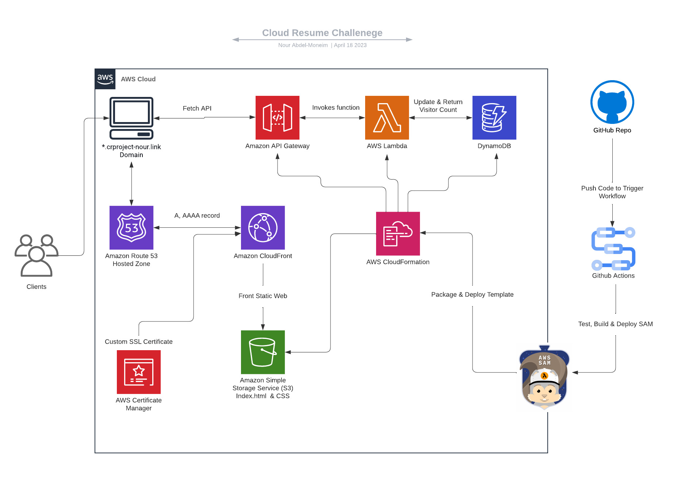

**Cloud Resume Challenge**

As a professional with a background in technology, I’ve always been fascinated by the potential of innovative solutions to transform businesses and improve the lives of people around the world. Recognizing the ever-growing importance of development and architecture in the tech landscape, I decided to delve deeper into these areas.

Throughout my journey, I’ve dedicated a considerable amount of time to eagerly learn and participate in AWS workshops and immersion days. My commitment to expanding my knowledge and skills in the cloud computing industry has led me to achieve two AWS certifications, including the Solutions Architect Associate, which has been instrumental in solidifying my expertise.

As I continue to immerse myself in the world of cloud computing, I am excited to apply my newly acquired skills and certifications to help organizations harness the power of technology and drive innovation. This transition in my career has been both challenging and rewarding, and I look forward to contributing to the development and architecture of cutting-edge solutions that will shape the future of the industry.

INTRODUCTION
I took on the Cloud Resume Challenge as a requirement for my capstone class, it was a fun cloud-based learning opportunity that allowed me to demonstrate my expertise in the realm of cloud computing. This assignment was a crucial part of my course as I was required to put my theoretical knowledge and AWS certifications to the test.

The project required me to construct my resume website from the ground up, host it on a cloud service provider like AWS, and integrate various cloud-native features including serverless functions, API integration, a NoSQL Database to store and retrieve a value for the amount of visitors that visited my site, and continuous integration/deployment. This not only put my technical abilities to the test, but it also drove me to explore new concepts and demonstrate my expertise in practical situations.

The Cloud Resume Challenge, with its emphasis on hands-on learning and practical application, has been a fantastic method for me to demonstrate my cloud competence while also fulfilling the criteria of my capstone class. The experience has monumentally aided my development as a cloud expert and prepared me for a successful career in the fast expanding sector of cloud computing.

[Take the cloud resume challenge](https://cloudresumechallenge.dev/docs/the-challenge/aws/)

**ARCHITECTURE**

INSTRUCTIONS
  1. **Certification**: Since I have previously obtained my AWS CCP I was able to skip this step.
  2. **HTML & CSS**: I needed a little bit of a refresher on this so I ended up enrolling in a free scrimba course, however, I was able to quickly tackle this and write my resumé in a simple manner.
  3. **Static Website**: I was able to host the website using S3 by enabling static website hosting after creating the Bucket.
  4. **HTTPS**: Fronted my S3 Bucket with a CloudFront distribution and redirected traffic from HTTP to HTTPS through my distibution.
  5. **DNS:** Created a Route53 Hosted Zone and registered a Domain, used newly registered domain as an ALIAS record for my CloudFront Distribution.
  6. **Javascript:** Although the requirement for this project was to only create JavaScript code to track and retrieve the visitor, I found myself really enjoying the things you can do with it so I integrated a live clock and an IP detector that also displayed on my static page.
  7. **DynamoDB & API**: Created and deployed DynamoDB table and API gateway using IaC code by leveraging AWS SAM
  8. **Lambda:** I used GO to write my Lambda code as I found more resources to follow pertaining to this specific use case, however I also wrote my Lambda code using python for my console based version of the project. I decided to use more of a microservices style approach by creating 2 functions instead of 1, allowing me to decouple my architecture and easily troubleshoot issues in case something goes wrong. By leveraging AWS SDK in my Lambda code I created a get function as well as a put function with my APIs in API gateway set as triggers for each function. Every time the Lambda function is invoked by my API the get function retrieves the most updated visitor count value from my DynamoDB table, and the put function is invoked to update the count by increments of 1.
  9. **CI/CD:** Although there are AWS services that can be leveraged for source control like CodeDeploy and CodePipeline, I chose to run my pipeline through “GitHub Actions”. In “Github Actions” I was able to specify a workflow Directory to run a script included within a file every time I decide to commit changes or update my code in the repository. In this script, I established test functions to test my lambda code as well as a build and deploy workflow to allow AWS SAM to package and deploy my template onto AWS.
      Note: make sure to store your AWS credentials in github secrets to avoid the public exposure of your programmatic access keys.
  10. **SNS:** I integrated a unique feature to heighten my project’s dynamism – a real-time email notification system to keep me informed about visitors to my resume website. To kick off this integration, I established an AWS Simple Notification Service (SNS) topic, to which I subscribed my email, paving the way for instantaneous email alerts upon any activity in the topic. Subsequently, I crafted a Lambda function using Python, designed to spring into action in response to modifications in my DynamoDB table, which meticulously logs the website’s visitor metrics. This function, upon detecting updates, extracts the fresh visitor count and dispatches a message to the pre-set SNS topic. To bridge the function with real-time table changes, I incorporated a DynamoDB stream, orchestrating it to activate the Lambda function for diverse table alterations, be it insertion, modification, or removal. The culmination of these steps is a seamless system where every fluctuation in my website’s visitor count promptly lands in my inbox as an email notification. This augmentation not only infuses a personal essence to the Cloud Resumé Challenge but also stands testament to my proficiency in weaving together diverse AWS services to sculpt a holistic serverless solution.
  11. **Blog:** My Blog is hosted on a WordPress application deployed on an AWS LightSail Instance. You can find it [here](https://www.pleasehireme.link/2023/04/19/cloud-resume-challenge/)
CHALLENGES
During the Cloud Resume Project, I didn’t face many significant challenges, but there were a few minor issues that I had to address and overcome. These issues provided valuable learning opportunities and allowed me to become more familiar with the cloud environment and the tools involved in the project.

The first issue I encountered pertained to AWS SAM while attempting to build the infrastructure. It turned out that I had made some errors when configuring the parameters on my AWS CLI, I misspelled the region instead of “us-east-1” I had it as “us east 1”. This seemingly small mistake led to me not being allowed to build the model. To resolve this issue, I put my CLI administrative skills to use and carefully reviewed the configurations and corrected it in my CLI to ensure that they were accurate and properly set up.

Another challenge I faced was getting my Lambda function to work correctly. I discovered that I had defined a value in my DynamoDB table as a string when it should have been a number. Troubleshooting this issue was a bit of a process, but I was able to leverage the CloudWatch logs for my Lambda function to determine where the issue originated from. This allowed me to backtrack my steps, identify the precise problem, and implement a fix.

Although these challenges were not insurmountable, they did require me to be resourceful, patient, and persistent. Throughout the process, I gained a deeper understanding of the cloud environment, AWS services, and best practices for troubleshooting issues. These experiences have better equipped me to handle future projects and challenges in the cloud domain.

SUMMARY
Completing the Cloud Resume Challenge was such an amazing experience for me. I’m so grateful for everything I’ve learned and the guidance I received throughout the process. Honestly, it’s been a game-changer.

I remember feeling so excited when I first started the project. It was a great opportunity to dive into cloud computing and explore AWS services. As I worked my way through it, I found myself getting more and more invested in the world of cloud technology. I couldn’t have asked for a better hands-on learning experience.

I’ll never forget how much I learned from the team, too. They were always there to help and answer any questions I had. It felt like we were all in this together, working towards a common goal. The skills I gained in frontend and backend development, as well as continuous integration and deployment, have been invaluable.

Now, I’m always on the lookout for new cloud-based projects to tackle. I’m eager to continue learning and applying the knowledge I’ve gained from the Cloud Resume Challenge. It’s been an incredible journey, and I can’t wait to see where it takes me next.

CHECK OUT MY RESUME [HERE](https://www.crproject-nour.link/)

